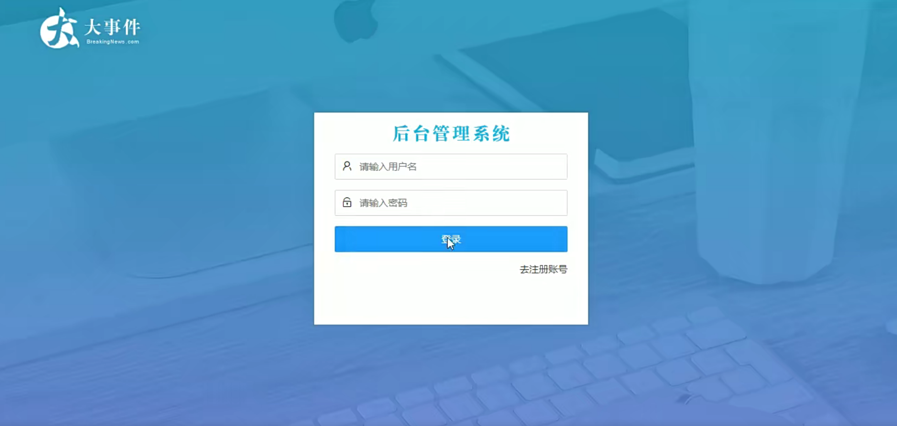
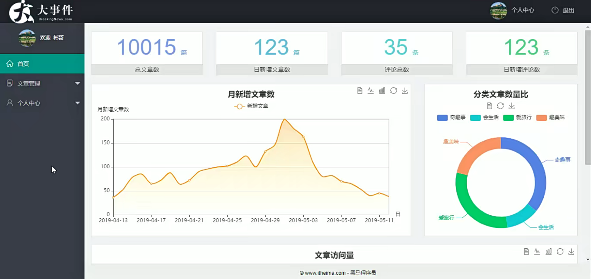
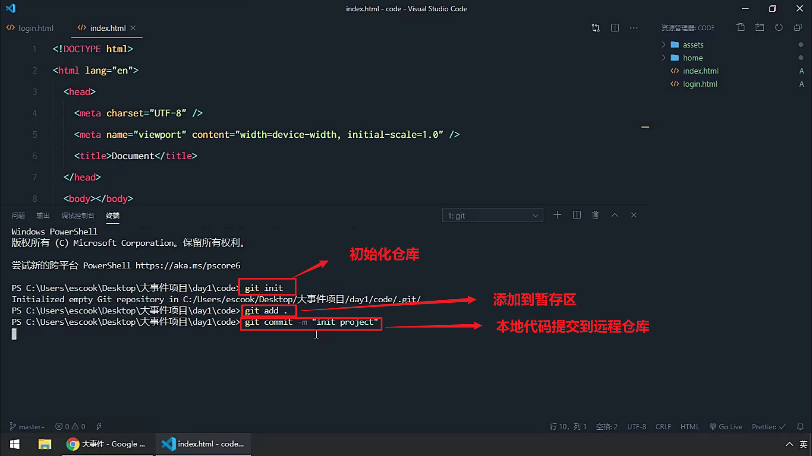
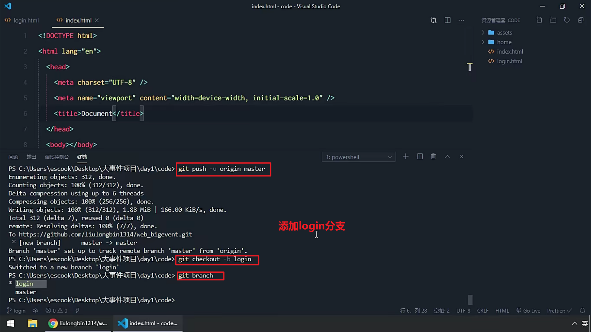

### 1.页面结构



---
### 2.把项目代码发送到GitHub



```
<!-- 初始化仓库 -->
git init
<!-- 把代码提交到暂存区 -->
git add .
<!-- 提交已暂存的文件 -->
git commit -m "提交了基础代码"
<!-- 本地仓库与GitHub建立联系 -->
git remote add origin git@github.com:terraria9747/big_event.git
<!-- 上传代码 -->
git push -u origin master
<!-- 添加分支 -->
git checkout -b login
```


