### 1.页面结构


---
### 2.把项目代码发送到GitHub


```
<!-- 初始化仓库 -->
git init
<!-- 把代码提交到暂存区 -->
git add .
<!-- 提交已暂存的文件 -->
git commit -m "提交了基础代码"
<!-- 本地仓库与GitHub建立联系 -->
git remote add origin git@github.com:terraria9747/big_event.git
<!-- 上传代码 -->
git push -u origin master
<!-- 添加分支 -->
git checkout -b login
```

---
### 3.插件Live Server


---
### 4.登录注册页面
1.用layui前端框架写出相关的样式<br>
<br>
2.写出登录模块和注册模块的交互效果<br>
点击 “没有账号? 去注册...” 按钮 跳转到 注册页面<br>
点击 “已有账号? 去登录...” 按钮 跳转到 登录页面<br>
<br>
3.接口文档连接<br>
```
https://apifox.com/apidoc/shared-fa9274ac-362e-4905-806b-6135df6aa90e/doc-842135
```
4.在注册页面发起Ajax.post请求, 注册接口如下
```
http://big-event-api-t.itheima.net/api/reguser
```
5.在登陆页面发起Ajax.get请求, 登录接口如下
```
http://big-event-api-t.itheima.net/api/login
```
注意: 此时有个问题, 每次发起请求, 都要重新输一次 url接口, 代码太繁琐<br>
<br>
我们可以创建一个baseAPI文件, 用来解决这个问题<br>
注意: 在每次发起 $.get(), $.post(), $.ajax() 请求之前<br>
会先调用一次 ajaxPrefilter() 这个函数<br>
在这个函数中, 我们可以获取到拼接好的url接口<br>


---
#### 登录注册页面提交到远程仓库

```
<!-- 切换到login分支 -->
git checkout login
<!-- 提交所有代码 -->
git add .
git commit -m "完成了登录和注册功能的开发"
<!-- 把本地代码提交到GitHub -->
git push -u origin login
<!-- 合并远程仓库的代码 -->
git checkout master
git merge login
```

---
#### 创建新分支, 继续在新分支上进行开发
```
<!-- 新建index分支 -->
git checkout -b index
```

---
### index主页面
后台主页面结构


插件：layui快速开发


侧栏区域


侧边互斥问题解决<br>
两个子菜单不能同时打开


layui图标


---
### iframe页面


---
### 获取用户的基本信息
```
<!-- 获取信息接口: -->
/my/userinfo
<!-- 需要配置headers请求头的信息 -->
<!-- 从本地存储中取出token的值 -->
headers: {
    Authorization: localStorage.getItem("token") || ""
},
```


有/my/的接口为有权限的接口 <br>
为每个有权限的接口都要添加headers请求头的信息 <br>
可以将公共部分写到 baseAPI.js文件中<br>
```
$.ajaxPrefilter(function(options) {
    // 拼接接口的url
    options.url = "http://big-event-api-t.itheima.net" + options.url;
    // console.log(options);

    // 为所有有权限的接口添加 headers
    // 有 /my/ 的为有权限的接口
    if (options.url.indexOf("/my/") !== -1) {
        options.headers = {
            Authorization: localStorage.getItem("token") || ""
        }
    }
})

```

---
### 渲染头像
如果用户原来有头像, 就用原先的头像<br>
如果没有, 就有首字母大写组成的文字头像<br>

---
### 退出登录
* 1.去除本地存储的token<br>
* 2.跳转到登录页面<br>


---
### 控制用户的访问权限
* 1.如果用户没有登录, 直接访问index.html
* 2.强制清除token
* 3.强制跳转到登录页面

---
### 优化权限代码
每当发起请求时, 成功success, 失败error, 成功或者失败complete <br>
baseAPI.js中<br>
```
options.complete = function(res) {
    if (res.responseJSON.message === "身份认证失败！" && res.responseJSON.status === 1) {
        // 1.强制删除token
        localStorage.removeItem("token");
        // 2.强制跳转到登录页面
        location.href = "/login.html"
    }
}
```

---
### index分支提交到远程仓库
```
git checkout index
git add .
git commit -m "完成了主页功能的开发"
git push -u origin index
git checkout master
git merge index
git push  <!-- 提交失败时运行 -->
```

---
### 建立新分支user
```
git checkout -b user
```

---
### 基本资料页面结构


---
### 初始化表单数据
form.val() 会使表单中的值会快速渲染到页面上
```
// formUserInfo: form表单
<form class="layui-form" lay-filter="formUserInfo">

// 快速获取表单信息并赋值
form.val("formUserInfo", res.data)
```
注意: 表单只读 - readonly

---
### 重置表单
用户输入的信息, 发现有错误时, 重置业务<br>
1.给按钮绑定点击事件<br>
2.阻止默认行为<br>
3.重新执行初始化函数<br>

---
### 修改表单内容
1.给表单绑定提交事件<br>
2.提交数据<br>
 - 快速获取表单内的值 <br>
```
$(this).serialize()
```

3.将提交的数渲染到父盒子前端页面上
 - 需要调用父亲的渲染函数
```
window.parent.getUserInfo();
```

---
### 修改头像


---
### 图片裁剪需要插件
<a href="插件/cropper基本用法.md">图片裁剪插件cropper的使用</a>

---
### 模拟用户上传图片
1.创建一个input file类型的输入框<br>
2.将input隐藏<br>
3.js控制点击上传按钮, 做点击input file事件<br>
4.指定上传的文件:<br>
```
<input type="file" id="btnChooseImages" accept="image/png, image/jpeg">
```

---
### base64格式的图片
1.上传的图片为base64格式的图片<br>
2.给提交按钮绑定点击事件<br>
3.绑定后，获取待上传图片的信息, 把图片转为base64格式<br>
4.发起ajax请求, 发图片信息一起发送给服务器<br>
5.服务器接收到图片信息后, 重新渲染页面, 让父亲中的图片显示<br>

---
### 上传代码
```
git add .
git commit -m "完成了个人中心相关功能的代码"
git push -u origin user
git checkout master
git merge user
git push
```

---
### 新建 article分支
```
git checkout -b article
```

---
### 文章类别图片
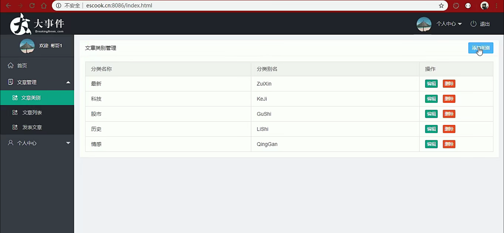

---
### 主页业务逻辑
1.layui搭建页面结构<br>
2.初始化页面结构<br>
3.get请求文章类别结构, 获取data数据<br>
4.模板引擎循环data数据<br>

---
### 添加类别业务
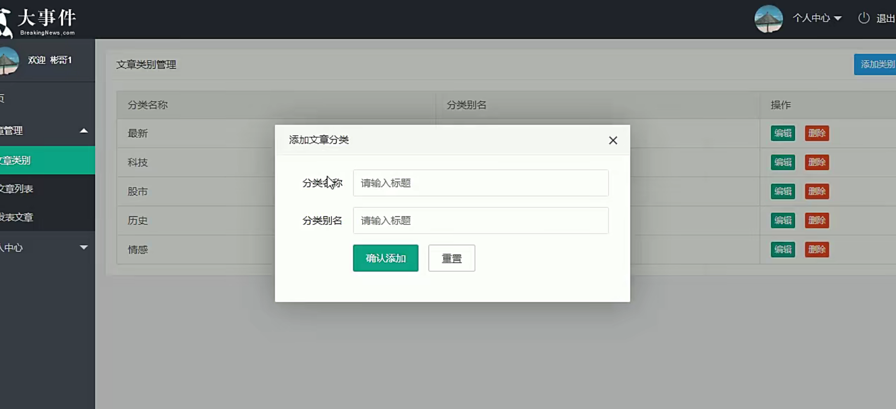
1.点击"添加类别"按钮<br>
2.输入相关信息<br>
3."确认添加"按钮使用代理绑定点击事件, 因为该窗口是点击"添加类别"按钮才创建的<br>
4.点击"确认添加"按钮后, 发起POST请求, 把数据提交<br>
5.数据提交后, 根据layui的索引值关闭窗口<br>
6.添加数据后, 重新渲染前端页面<br>

---
### 编辑类别业务
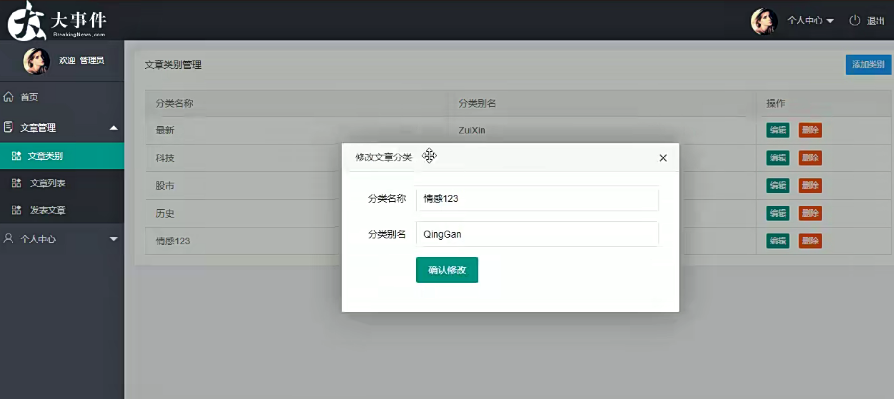
1.点击 "编辑" 按钮, 默认会显示之前的数据<br>
2.在HTML "编辑" 按钮声明一个自定义变量, 用来存储id<br>
3.点击 "编辑" 按钮时, 发起GET请求获取当前点击按钮的数据,包括Id, 分类名称, 分类别名等消息<br>
4.在弹出框创建一个隐藏域, 用来存储Id<br>

---
### 文章删除
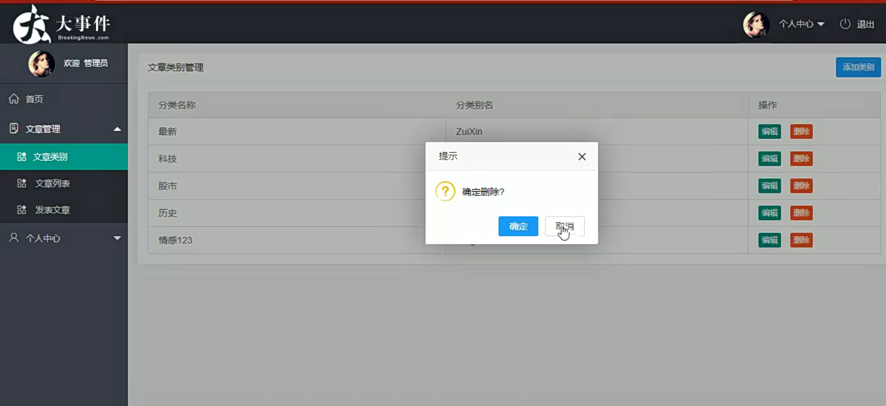
1.点击 "删除" 按钮<br>
2.弹出layui相关框<br>
3.发起 "删除" 相关的请求<br>
4.重新渲染前端页面<br>

---
### 文章列表


---
### 渲染页面
1.由于原有教程接口无法使用, 这里我使用的 `/my/article/cates` 接口<br>
2.请求该接口获取部分数据, 渲染到前端页面, <br>
3.没有的数据自己构造<br>

---
### 筛选区域
1.筛选模块本质上是一个form表单<br>
2.给表单绑定提交事件<br>
3.提交后发起请求, `/my/article/cates/{id}`<br>
4.并重新渲染页面<br>

---
### 分页效果
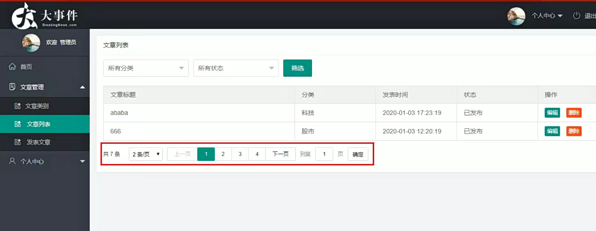

1.定义渲染分页的方法<br>
2.在上部数据渲染完成后, 开始渲染下边的分页区域<br>

--- 
### 结构
1.利用layui构建页面结构<br>
2.利用laypage.render渲染分页结构<br>
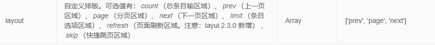
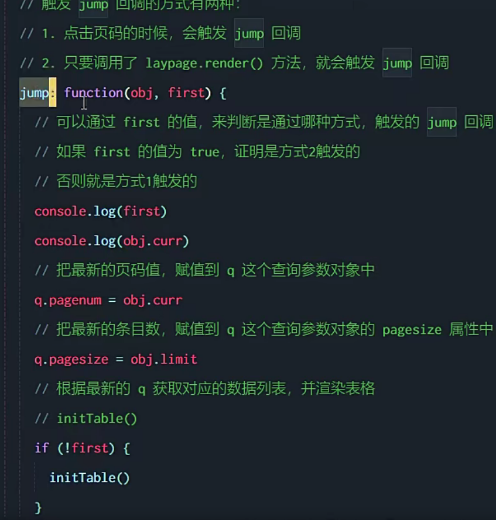

---
### 删除文章
1.点击删除按钮, 弹出询问框<br>
2.给按钮添加自定义属性, 用来存储ID<br>
3.通过代理的方式给按钮绑定点击事件<br>


---
### 文章删除的问题
1.比如目前在第4页, 有两条数据<br>
2.删除这两条数据后, 第4页没有数据了, 页面是空的, 但是页码显示在第3页<br>
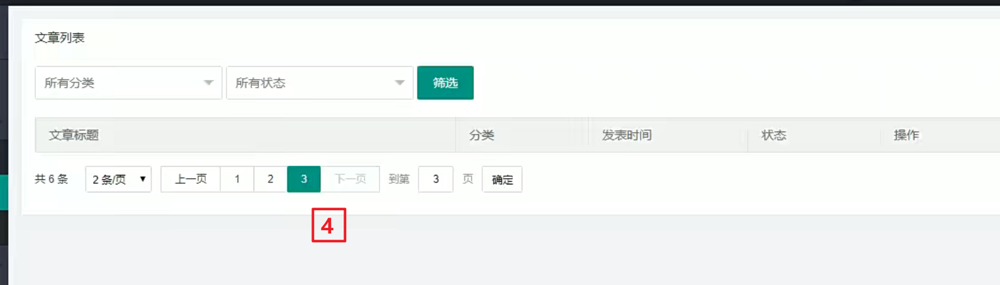
3.问题分析:
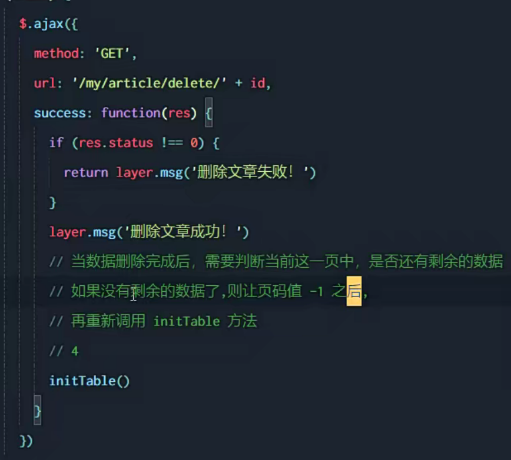
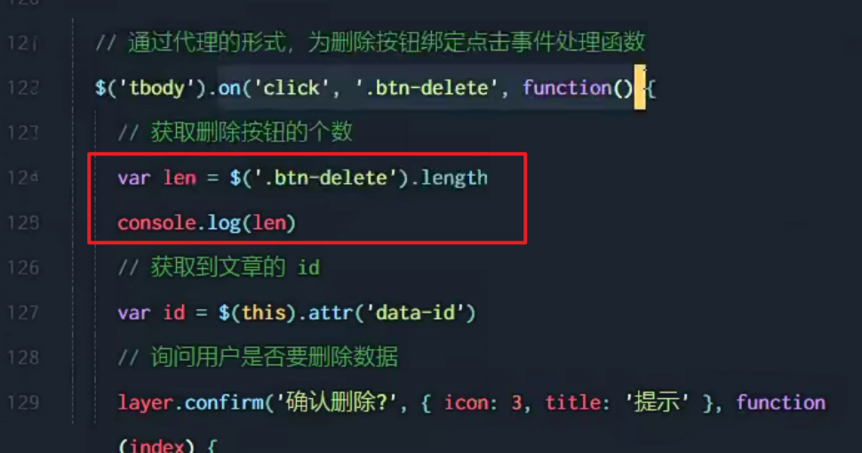
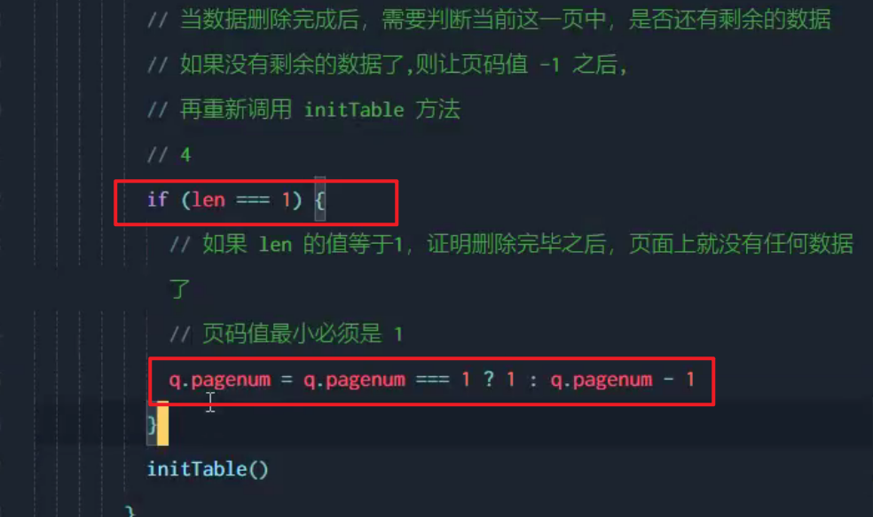

---
### 发表文章
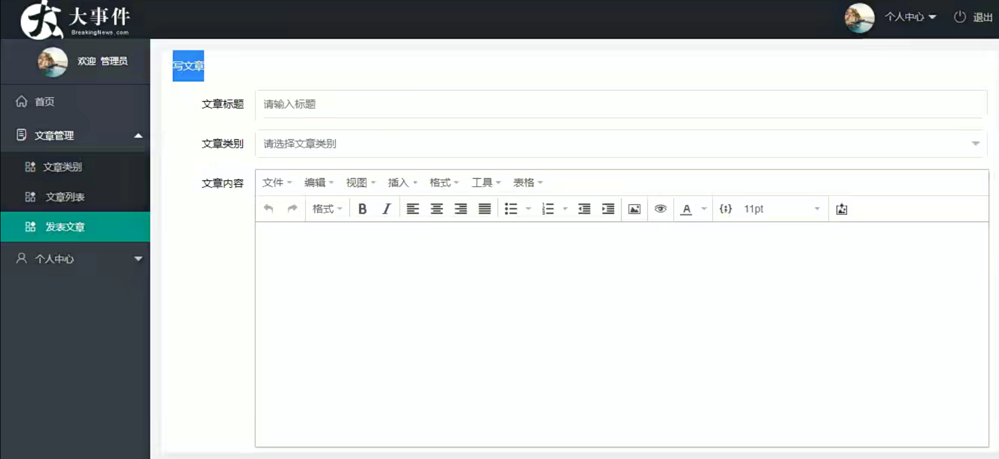
1.构建结构<br>
2.复选框结构搭建 需要 用API接口内的数据来进行渲染<br>

---
### 富文本编辑器
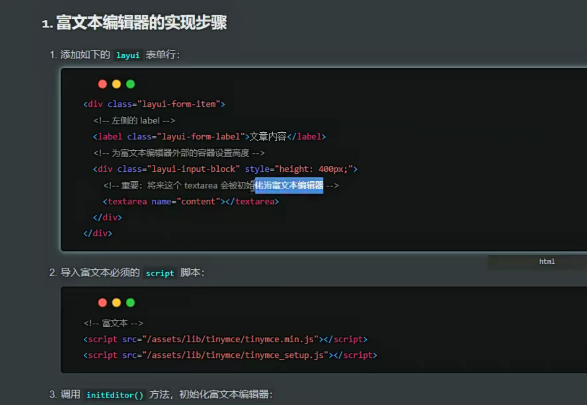
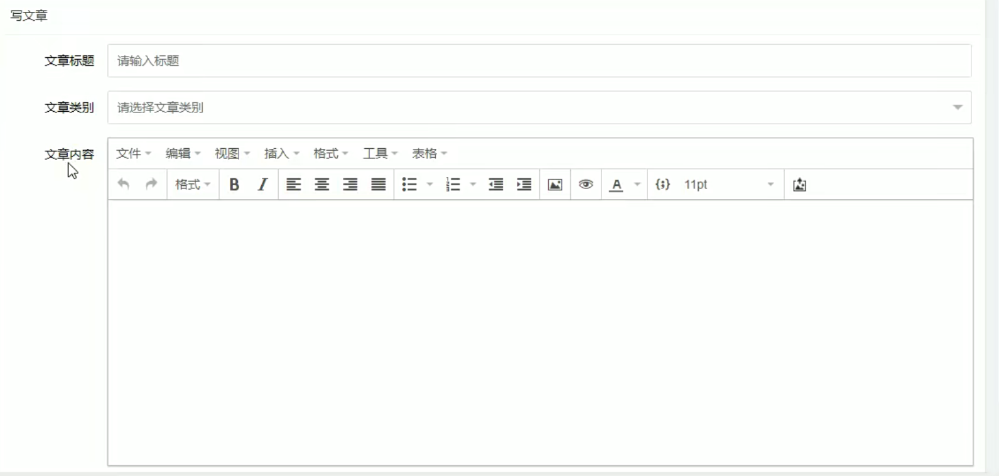

---
### 图片裁剪区域
1.老样子, 创建一个隐藏域, 用来模拟用户文件上传<br>
2.为 "选择封面" 按钮绑定一个点击事件,<br>
3.点击之后, 打开隐藏域, 选择文件<br>
4.根据文档进行代码修改<br>
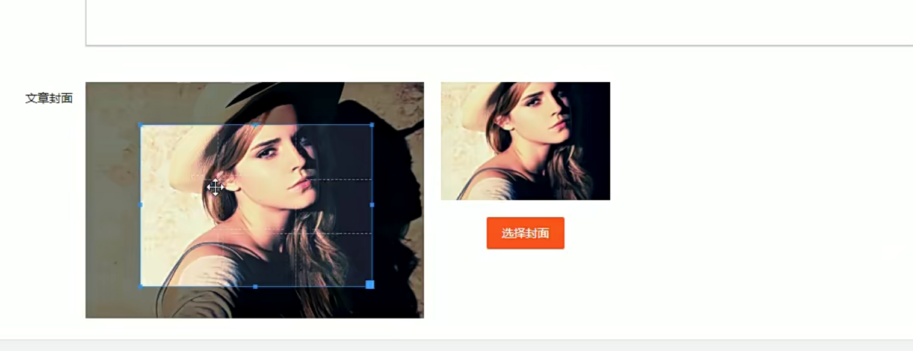

---
### 发表文章
1.为表单绑定 提交 事件 <br>
2.创建FormData对象, 用来接收参数 <br>
3.获取裁剪后的图片<br>
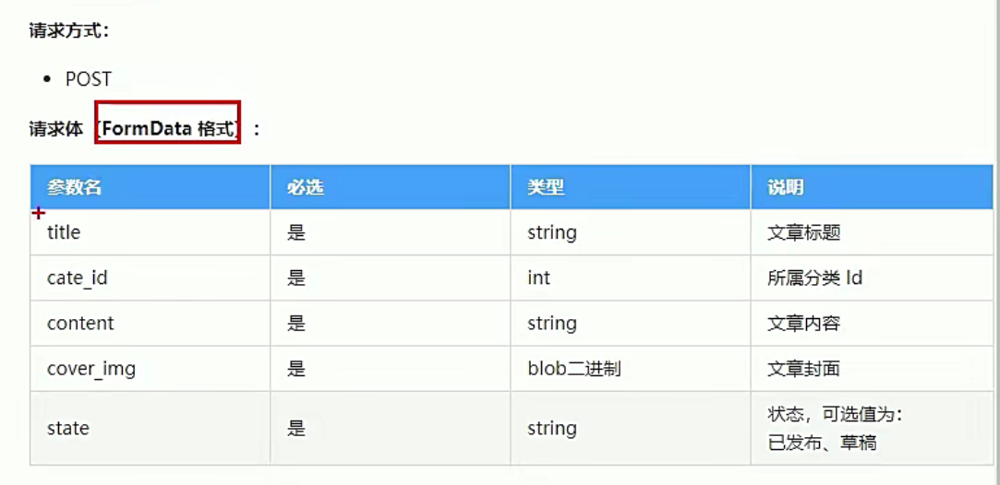
```
// 提交事件
$("#form-pub").on("submit", function(e) {
    // 1.阻止默认提交行为
    e.preventDefault();

    // 2.基于 form 表单, 快速创建一个 FormData对象
    var fd = new FormData($(this)[0])

    // 3.将文章的发布状态, 存到fd中
    fd.append("state", art_state)

    // 4.循环FormData对象
    fd.forEach(function(v, k) {
        console.log(k, v);
    })
})
```

4.如果向服务器提交的是 FormData 格式的数据
必须添加两个配置项
```
contentType: false,
processData: false,
```


